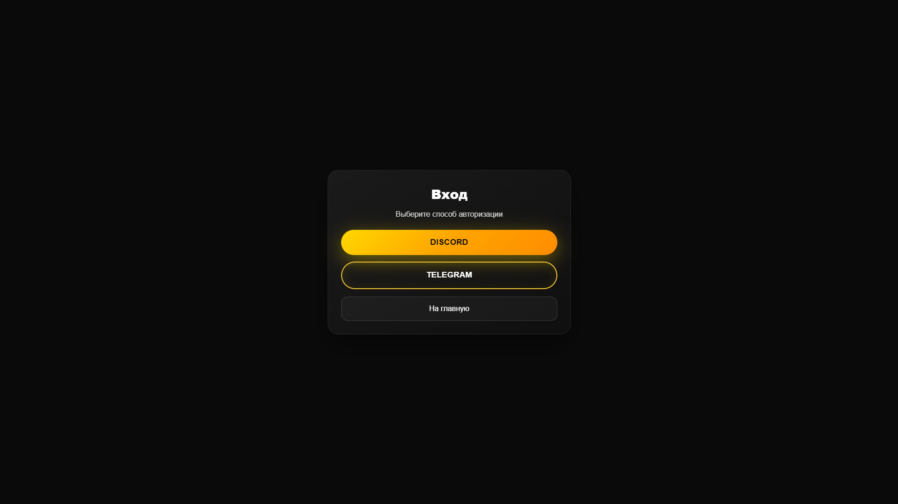
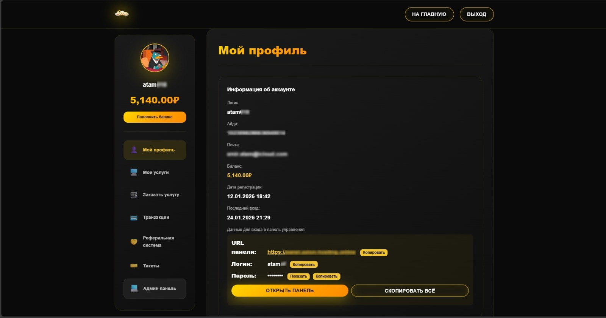
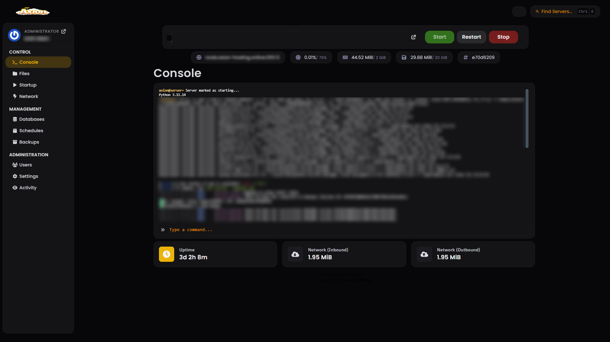

  <a href="README.md">English</a> |
  <a href="README_RU.md">Русский</a>

# Axion Hosting Platform

SaaS-платформа для продажи и управления игровыми серверами и веб-хостингом.

Проект представляет собой полноценную систему, в которой пользователь после покупки тарифа получает реальные вычислительные ресурсы выделенного сервера и доступ к панели управления для запуска собственных серверов, приложений и сервисов.

🌐 Website: https://axion-hosting.ru  
💬 Discord: https://discord.gg/pYeqyfKJmZ

---

##  Project Status

Проект разрабатывался как учебно-практический стартап и продакшен-подобная система.  
На данный момент платформа не используется в активной коммерческой эксплуатации и рассматривается как демонстрация архитектурных и инженерных решений.

---

##  Key Features

- Регистрация и авторизация пользователей  
- OAuth авторизация через Discord и Telegram  
- Личный кабинет пользователя  
- Покупка тарифных планов  
- Автоматическое создание аккаунтов в панели управления серверами (Pterodactyl)  
- Выдача пользователю доступа к выделенным ресурсам VDS  
- Управление услугами через панель  
- Панель администратора  
- Внутренний API для управления сервисами  
- Веб-хуки для обработки платежей  

---

##  Technology Stack

**Backend**
- PHP  
- REST API  

**Frontend**
- HTML / CSS  

**Database**
- MySQL  

**Integrations**
- Payment system integration  
- Discord OAuth  
- Telegram OAuth  
- Pterodactyl Panel API  

**Infrastructure**
- Linux  
- Nginx / Apache  
- VDS  

##  System Architecture

Платформа состоит из следующих основных компонентов:

- Web Application (Frontend + Backend)  
- Authentication Service (Discord / Telegram OAuth)  
- Billing & Order Service  
- Provisioning Service (создание аккаунтов и услуг)  
- Integration with Pterodactyl Panel  
- Admin Panel  
- Internal API  
- Database  

### Provisioning Flow (упрощённо)

1. Пользователь регистрируется и входит в систему  
2. Выбирает тариф и оформляет заказ  
3. После подтверждения платежа:
   - автоматически создаётся аккаунт в панели Pterodactyl  
   - выделяются ресурсы на VDS  
   - генерируются данные для входа в панель  
4. Пользователь получает доступ к панели управления серверами  
5. Управление серверами происходит напрямую через Pterodactyl  

Таким образом, платформа предоставляет пользователю реальные ресурсы выделенного сервера для запуска собственных серверов, приложений и сервисов.

---

##  Security & Source Code

Этот репозиторий содержит очищенную публичную версию кодовой базы Axion Hosting SaaS.

Из проекта удалены все production-секреты, API-ключи, токены, webhook URL, данные подключения к базе данных, пользовательские файлы и deployment-specific конфигурации.

Проект опубликован как portfolio case study, чтобы показать архитектуру, backend-логику, интеграции и provisioning workflow хостинг-платформы.

Для production-развёртывания необходимо создать локальный .env файл на основе .env.example.
---

##  Team

Проект разработан в команде из двух человек:

- Backend / System Architecture — atamnf 
- Full-Stack Developer — improving1337 

---

##  What This Project Demonstrates

- Проектирование SaaS-платформ  
- Интеграция с внешними панелями управления (Pterodactyl)  
- Автоматическое выделение ресурсов на VDS  
- Работа с OAuth (Discord, Telegram)  
- Интеграция платёжных систем  
- Проектирование API  
- Проектирование provisioning-систем  
- Администрирование и инфраструктура  

---

##  Links

- Website: https://axion-hosting.ru  
- Discord: https://discord.gg/pYeqyfKJmZ

##  Screenshots

  
  
  

##  Architecture

- [System Overview](architecture/system_overview.md)
- [System Components](architecture/components.md)
